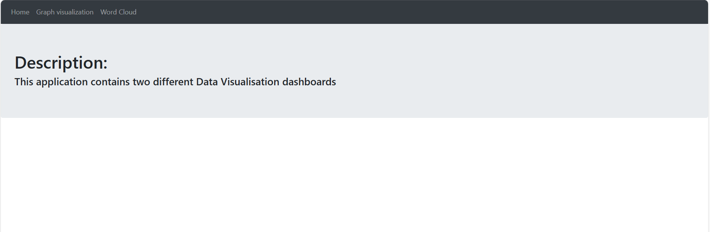

# Data-visualization
This application is related to data visualization and is built using ReactJS. It contains two different types of visualizations. One is a graph visualization and the other one is a Word cloud.

## Technologies used
* [ReactJS](https://react.dev/) is a free and open-source front-end JavaScript library for building user interfaces based on components.
* [JavaScript](https://developer.mozilla.org/en-US/docs/Web/JavaScript) is a lightweight interpreted (or just-in-time compiled) programming language with first-class functions.
* [CSS](https://developer.mozilla.org/en-US/docs/Web/CSS) is a stylesheet language used to describe the presentation of a document written in HTML or XML (including XML dialects such as SVG, MathML or XHTML). CSS describes how elements should be rendered on screen, on paper, in speech, or on other media.
* [HTML5](https://html.com/html5/) used to create the web page UI)

## Setup

* Download the repository, navigate to the root folder and run the command "npm install" to install dependencies
* Now run the command "npm start" to start up the server
* Navigate to localhost:3000 to see the Home page
* On a Server, Restful APIs are created which server JSON data and these are consumed by the front-end 

## Screenshots
-----
* Home Component

.

----
* Graph visualization Component

.

-----
* Word Cloud Component

.
